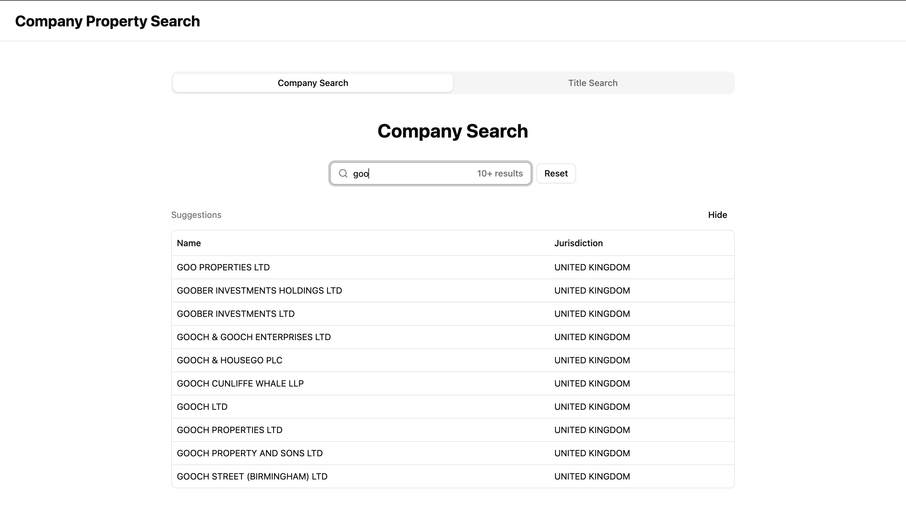
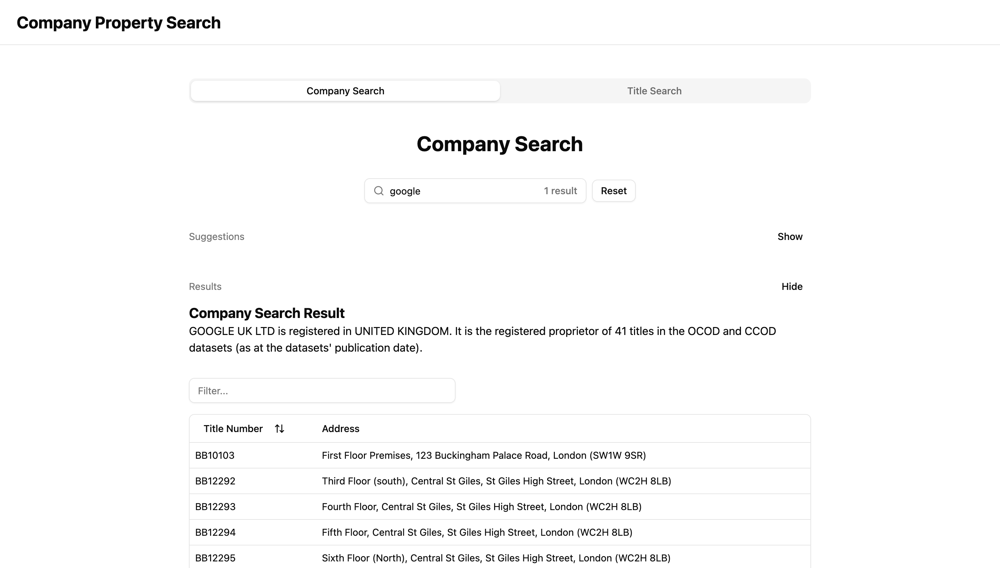
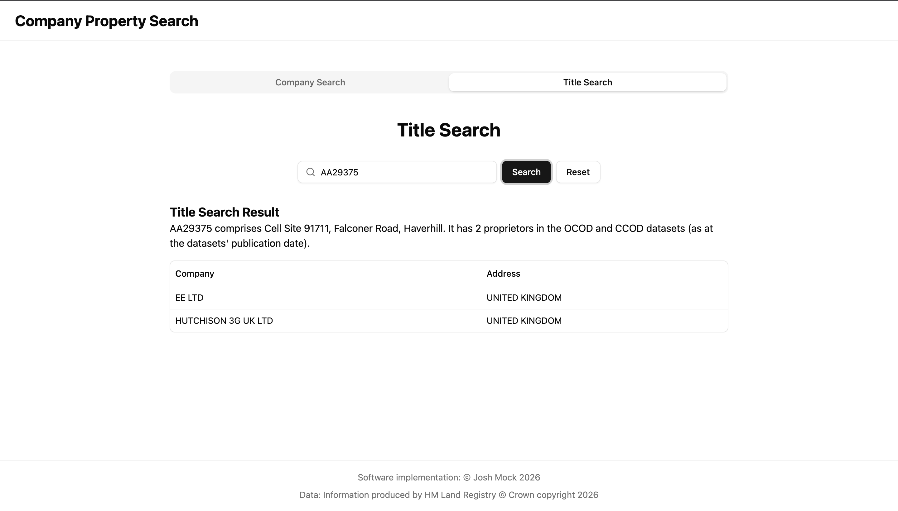

# Company Property Search

A tool that simplifies searching the OCOD and CCOD datasets


## Authors

- [@josh-mock](https://www.github.com/josh-mock)

## Features

- **Company search**: Search for companies and view their associated property titles
- **Title search**: Search title numbers and view their associated companies
- **Local database**: Once installed and built, no need for an internet connection to run queries
- Interface built with Shadcn

## Screenshots





## Run Locally

### Setup

Sign up for the HM Land Registry [data license](https://use-land-property-data.service.gov.uk/) and make a note of your API key if you are given a free license for the OCOD and the CCOD datasets.

Clone the project

```bash
  git clone https://github.com/josh-mock/company-property-search
```

Go to the project directory

```bash
  cd company-property-search
```

Run the setup script

```bash
  bash run.sh setup
```

This will install the dependencies, download the data, build the DB, build the app, and start the production server.

### Updates

HM Land Registry releases monthly updated files. To rebuild the database with the updated files, run the load script from the project root.

```bash
bash run.sh load
```

To update the entire application following an update pushed to GitHub, run the update script from the project root.

```bash
bash run.sh update
```

### Running the app

You do not need to build and reinstall every time you want to use the app. If you have recently updated, you can just run the start script from the project root.

```bash
bash run.sh start
```

## License

**Software implementation**: [MIT](LICENSE)

**HM Land Registry Data**: Information produced by HM Land Registry &#169; Crown copyright 2026. Users are responsible for complying with the HM Land Registry terms of use. This project provides tooling for licensed users to query and display data privately. The authors accept no liability for how the data is used.
